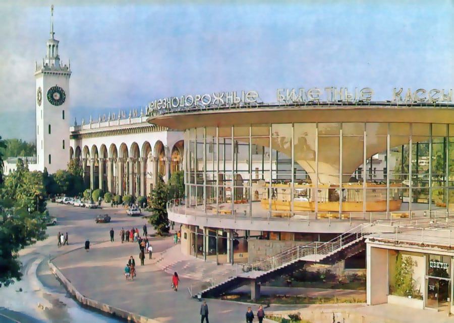
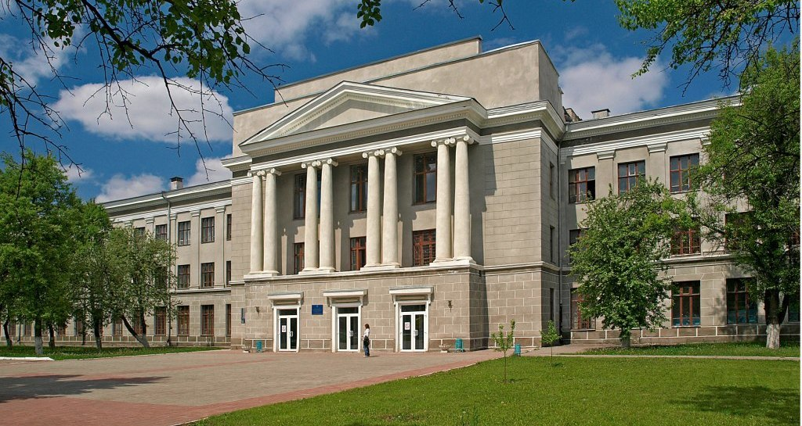
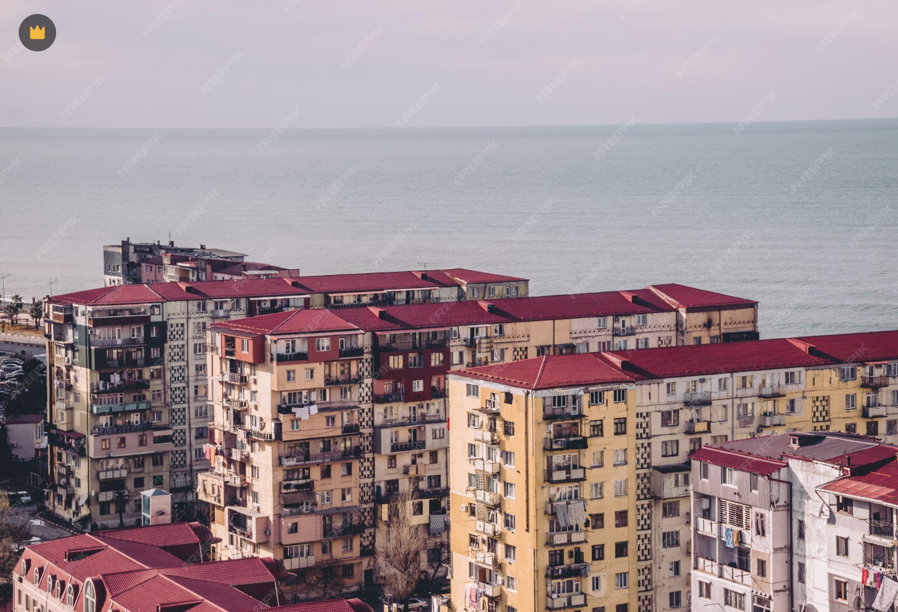
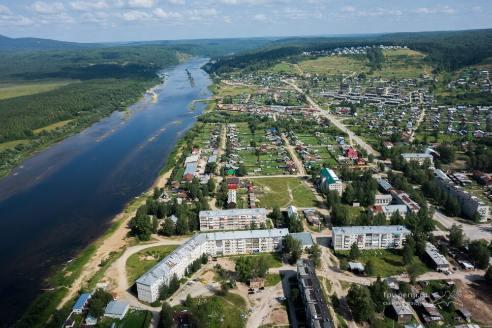
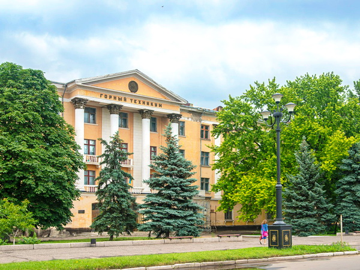

# Привет-привет!
В папках на этом гитхабе спрятан твой подарок!  
Номера папок варьируются от 1 до 6 таким образом, что вложенные папки формируют комбинацию из 6ти цифр без повторений. В каждой последней папке - картинка, одна из них твой подарок!
Номера папок закодированы фотографиями значимых городов твоей жизни. Чтобы найти правильную последовательность папок, нужно расположить эти фотографии (а точнее их номера) в той последовательности, в которой ты в них жил!

### Фото 1

### Фото 2

### Фото 3

### Фото 4

### Фото 5

### Фото 6

